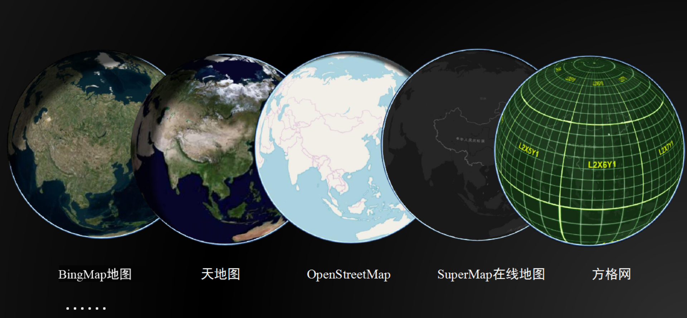
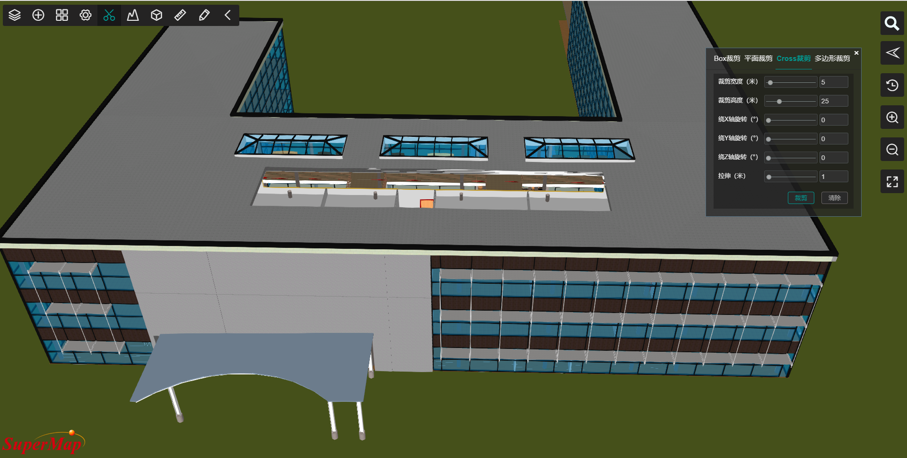
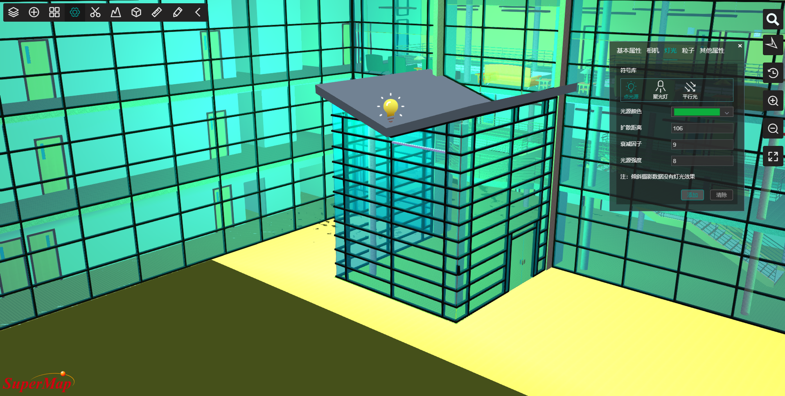

# <center>SuperMap Vue-iEarth</center>
## Build Setup

``` bash
# install dependencies
npm install

# serve with hot reload at localhost:8080
npm run dev

# build for production with minification
npm run build

```
# 简介
[SuperMap iEarth](http://www.supermapol.com/earth/vue-iEarth/)是基于全功能三维“零客户端”[SuperMap iClient3D for WebGL](http://support.supermap.com.cn:8090/webgl/examples/webgl/examples.html#layer)开发的一款三维在线应用程序。在多源数据加载、三维空间分析以及多种可视化效果等功能的支撑下，用户可以通过SuperMap iEarth在浏览器上进行三维浏览及应用。

# 功能模块

## 1. 全数据加载

SuperMap iEarth全面支持倾斜摄影数据、BIM数据、激光点云数据、三维场数据、三维地形数据、手工建模三维数据、符号化三维场景、地下管线三维数据等多种数据，实现多源数据融合，构建逼真的三维场景。

全数据支持


多种底图支持



## 2. 三维分析
SuperMap iEarth支持多种形式的三维空间分析功能。

- 通视分析
- 阴影分析
- 剖面分析
- 可视域分析
- 天际线分析
- 等值分析
- 坡度坡向分析
- 淹没分析

可视域分析


坡度坡向分析


## 3. 裁剪

SuperMap iEarth支持多种裁剪方式。

- Box裁剪
- 平面裁剪
- Cross裁剪
- 多边形裁剪

Cross裁剪




## 4. 辅助功能

- 飞行
- 灯光
- 分屏
- 卷帘
- 泛光
- 符号化
- 空间量算
- 模型/地形的修改/开挖

灯光



符号化


# 部署方式

将SuperMap iEarth置于SuperMap iServer的webapps下，通过SuperMap iServer发布的服务即可在SuperMap iEarth中浏览和操作三维场景。

# 许可

[Apache License 2.0](https://github.com/SuperMap/SuperMap-iEarth/blob/master/LICENSE)

