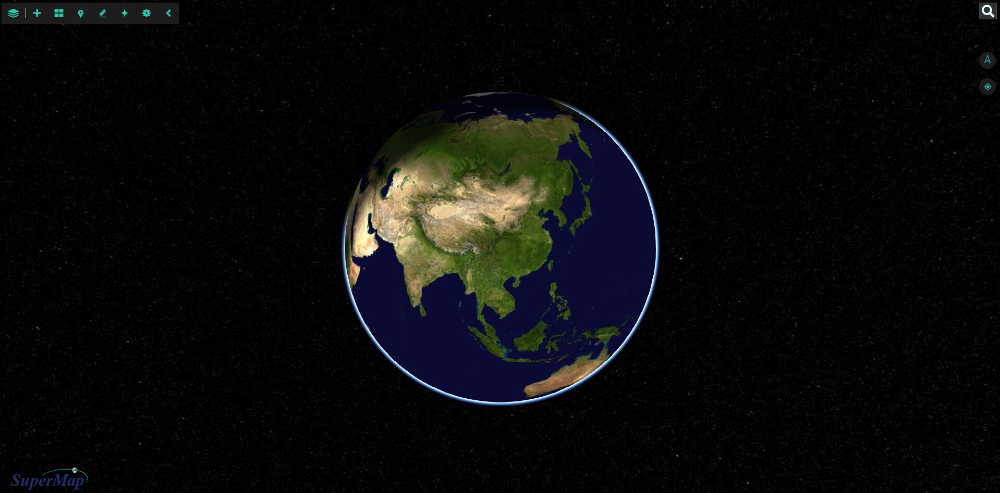

# SuperMap Earth

# 简介：
SuperMap Earth是基于Supermap iClient 3D for WebGL的一款轻量级的在线三维应用，能快速展示多种二维及三维数据。

 * 网站：https://supermap.github.io/Supermap_Earth/

# 功能特点：

 * 支持天地图、Bingmap、OpenStreetMap、STK地形等在线公用服务；
 * 支持SuperMap iServer 的地图服务、影像服务、地形服务、倾斜摄影数据服务等
 * 图层管理；
 * 添加地标；
 * 量算；
 * 场景元素管理；
 * 范例展示；

